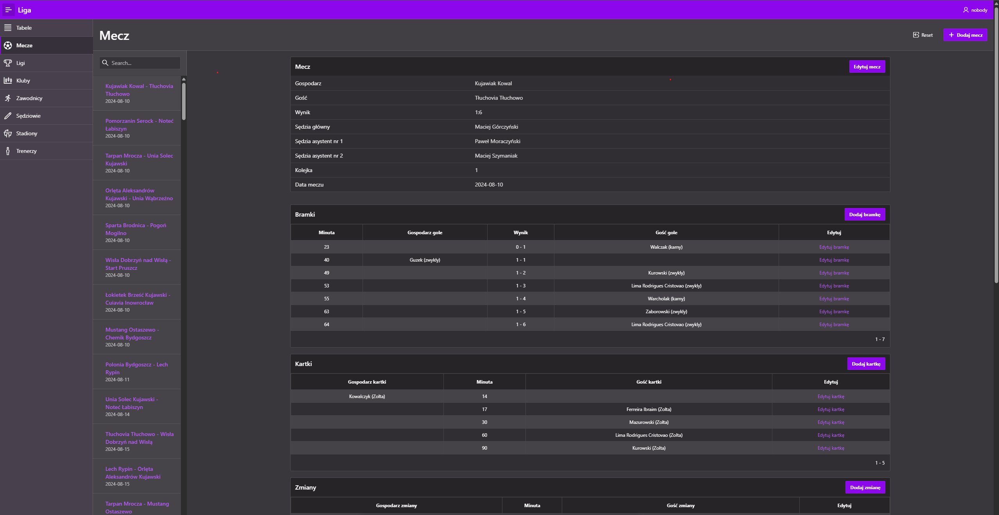
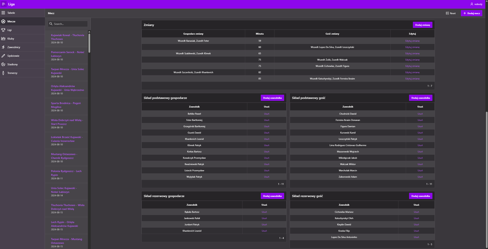
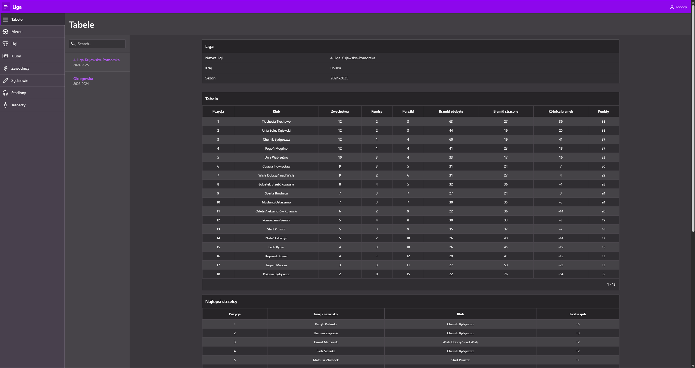
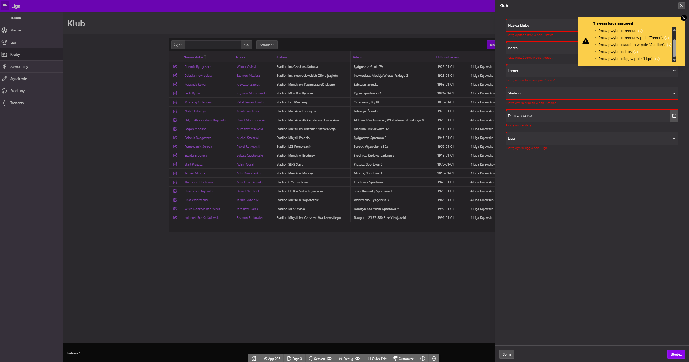

## System zarządzania danymi meczowymi w Oracle APEX

Ten projekt to kompleksowy system do zarządzania i analizy statystyk z lig piłkarskich, stworzony w **Oracle APEX**. Aplikacja umożliwia przeglądanie, analizowanie i zarządzanie danymi o zawodnikach, meczach, klubach i ligach. Możesz też dodawać własne mecze ze składami, co daje pełną kontrolę nad informacjami.

---

## Źródło danych

Dane do systemu są pobierane poprzez web scraping ze strony regiowyniki.pl. Używam do tego skryptu match_scraper.py z biblioteką Selenium. W ramach projektu, do bazy danych trafiły przykładowe dane z pierwszej rundy IV ligi kujawsko-pomorskiej. Skrypt automatycznie zbiera:

- Linki do drużyn z ligi.
- Szczegółowe informacje o meczach: daty, godziny, sędziów (główny i asystenci), wyniki, składy podstawowe i rezerwowe.
- Zdarzenia meczowe: bramki, kartki, zmiany.
Wszystkie te informacje są zapisywane w pliku match_data.json.

---

## Generowanie danych SQL

Za pomocą `sql_generator.py` dane JSON są konwertowane do zestawu plików `.sql` gotowych do importu do bazy Oracle. Tworzone są m.in. pliki:

- `sedzia.sql` – dane sędziów,
- `mecz.sql` – dane meczów,
- `zawodnicy.sql` – dane zawodników,
- `skladmeczowy.sql` – składy drużyn,
- `zdarzeniemecz.sql` – zdarzenia ogólne,
- `zdarzeniemeczgol.sql`, `zdarzeniemeczkartka.sql`, `zdarzeniemeczzmiana.sql`.

Pliki są scalane w jeden `all_data_new.sql` przez `file_merger.py`.

---

##  Funkcjonalności aplikacji APEX

###  Mecze

- Lista wszystkich meczów z możliwością filtrowania (np. po klubie).
- Szczegóły meczu: data, godzina, sędziowie, wynik, stadion.
- Wyświetlanie składów podstawowych i rezerwowych.
- Tabela zdarzeń (gole, kartki, zmiany).
- Możliwość edycji meczu oraz dodawania nowych zdarzeń.

---

###  Tabele ligowe

- Dynamicznie tworzona tabela na podstawie rozegranych meczów.
- Statystyki: Prezentowane są kluczowe wskaźniki, takie jak liczba meczów, punkty, bilans bramek i miejsce w tabeli. Aplikacja pokazuje również statystyki bramek strzelonych i kartek.

--- 

---

### Pozostałe tabele
System zapewnia pełną obsługę CRUD z zaawansowaną walidacją danych dla kluczowych tabel:
- sędziowie,
- trenerzy,
- stadiony,
- zawodnicy,
- kluby,
- ligi

Przykład błedów walidacji:

---

##  Technologie

- **Oracle APEX** – logika aplikacji i frontend.
- **Oracle Database** – przechowywanie danych.
- **Python + Selenium** – scraping danych

